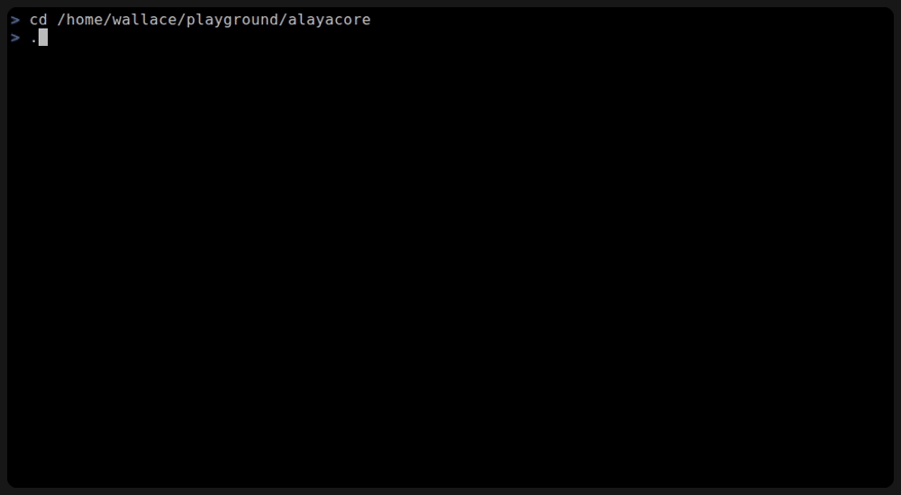
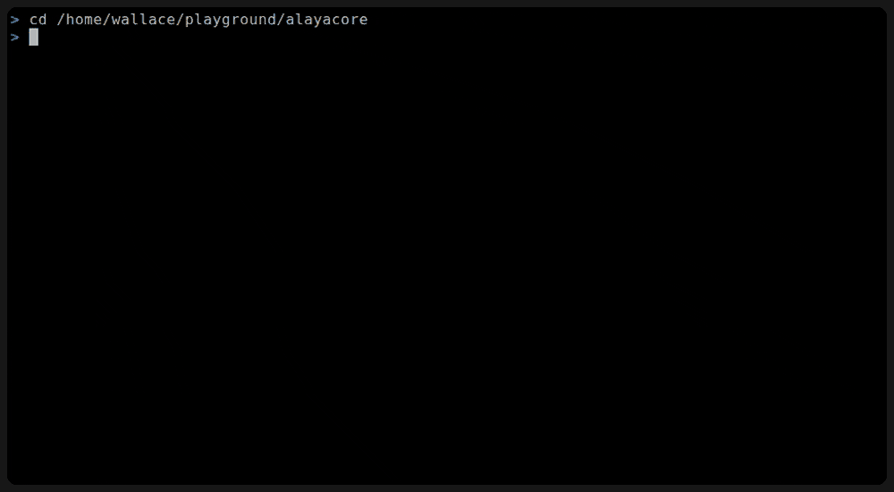

# AlayaCore

[English](README.md) | [中文](README.zh-CN.md)

[]()
[]()
[](https://github.com/alayacore/alayacore/releases)

A fast, minimal AI Agent for your terminal, scripts, and programmatic control.

## Table of Contents

- [Modes](#modes)
- [Quick Start](#quick-start)
- [Features](#features)
- [System Requirements](#system-requirements)
- [Building from Source](#building-from-source)
- [Anthropic API Note](#anthropic-api-note)
- [Documentation](#documentation)
- [License](#license)

## Modes

**TUI Mode** — split-pane interface with streaming output, vim navigation, and session management.



**Plain IO Mode** — plain stdin/stdout for interactive use without a TUI (works on any terminal, including teletype).


**Terse IO Mode** — read all of stdin as one prompt or command, print only the final answer (stdout stays clean, errors go to stderr). Note: `--tool-confirm` is rejected in this mode — stdin is consumed as the prompt, so tool confirmations could never be answered.



**Raw IO Mode** — full control and integration with other programs via raw TLV frames on stdin/stdout.


AlayaCore connects to any OpenAI-compatible or Anthropic-compatible LLM and gives it the tools to read, write, and edit files, and execute commands — with session persistence and multi-step agentic tool-calling loops. The same agent core powers all four modes: **TUI** (interactive terminal interface), **Plain IO** (interactive plain-text stdin/stdout without a TUI), **Terse IO** (answer-only for pipes and scripts), and **Raw IO** (raw TLV frames for programmatic control).

**Choose a mode:** interactive TUI → run `alayacore` · interactive without a TUI → `--plainio` · scripts/pipes → `--terseio` · programmatic control → `--rawio`

## Quick Start

**Option 1:** Download from [GitHub Releases](https://github.com/alayacore/alayacore/releases), extract, and add to `PATH`.

**Option 2:** Install with Go:

```sh
go install github.com/alayacore/alayacore@latest
```

Then run `alayacore`.

On first run, AlayaCore auto-creates a default model config at `~/.alayacore/model.conf` configured for Ollama. Edit it to point at your preferred provider.

For scripts and pipes — one prompt in, only the final answer out:

```sh
echo "what is 2+2?" | alayacore --terseio
```

> See the [Getting Started Guide](docs/getting-started.md) for CLI flags, examples, and detailed setup.

## Features

### Core (all adapters)

- 🤖 **Autonomous tool-calling loop** — The LLM plans, calls tools, and iterates until the task is done (no step limit by default; optionally bounded with `--max-steps`).
- 🛠️ **Five built-in tools** — `read_file`, `edit_file`, `write_file`, `execute_command`, `search_content`. Controlled via `--builtin-tools` (default: all enabled).
- 🌐 **Cross-platform** — Runs on Linux, macOS, and Windows. The `execute_command` tool auto-detects the shell (bash/zsh/sh on Unix, PowerShell/cmd on Windows).
- 🧠 **Any LLM provider** — OpenAI, Anthropic, DeepSeek, Qwen, Ollama, LM Studio. Multiple models in one config, switch at runtime.
- 🔗 **MCP support** — Connect to external [Model Context Protocol](https://modelcontextprotocol.io) servers for database queries, API access, code analysis, and more via `mcp.conf`.
- 💾 **Session persistence** — Save and resume conversations automatically when `--session` is specified; `:save` at any time — even mid-task — snapshots all completed steps.
- ✂️ **Auto-summarization** — When the context approaches the model's limit, older turns are compressed automatically so long sessions stay within the window (`--auto-summarize <percent>`).
- 🎯 **Skills system** — Extend the agent with instruction packages following the [Agent Skills](https://agentskills.io) spec.
- ✅ **Configurable tool confirmation** — Require manual approval for specific tools via `--tool-confirm`.

### TUI (terminal interface)

- 🖥️ **Streaming output** — Real-time display with virtual scrolling, foldable windows, and vim-like keybindings.
- ⚡ **Provider speed tracking** — Live end-to-end tok/s and time-to-first-token (TTFT) for the latest step in the status bar (see [speed-tracking.md](docs/speed-tracking.md)).
- 📊 **Markdown rendering** — Assistant markdown output (currently tables) renders by default; press `r` on an unfolded window to toggle raw/rendered (`--no-markdown` disables the default).
- 📷 **Multi-modal input** — Attach images, audio, video, or documents alongside text via `Ctrl+A`.
- 🎨 **Theme system** — Customizable color schemes with live switching.
- ⌨️ **Model selector, theme selector, help window** — Overlay-based UI components for runtime configuration.

### Plain IO (`--plainio`)

- 📟 **TUI-free interactive** — Full plain-text transcript (echoed prompts, reasoning, tool calls, results) over stdin/stdout.

### Terse IO (`--terseio`)

- 🎯 **Answer-only** — Read all of stdin as one prompt (or one command if it starts with `:`), print only the final answer (errors to stderr, exit codes signal failure). Ideal for pipes and scripts.

### Raw IO (`--rawio`)

- 🔌 **Programmatic control** — Raw TLV frames on stdin/stdout for custom integrations.

## System Requirements

- **OS**: Linux, macOS, or Windows
- **Note**: The `search_content` tool requires [ripgrep](https://github.com/BurntSushi/ripgrep) (`rg`) to be installed on the system.

## Building from Source

**Prerequisites**: [Go 1.26.1+](https://go.dev/dl/)

```sh
git clone https://github.com/alayacore/alayacore.git
cd alayacore
go build -o alayacore .
```

**Run tests**:

```sh
go test ./...
```

## Anthropic API Note

AlayaCore does **not** send Anthropic-specific `cache_control` in the request body. This project targets anthropic-compatible providers (DeepSeek, MiniMax, MiMo, Ollama, LM Studio, etc.) that handle caching transparently.

If you connect directly to the Anthropic API and want prompt caching, place a proxy between AlayaCore and Anthropic that injects `"cache_control":{"type":"ephemeral"}` into the JSON request body. Tools like [mitmproxy](https://mitmproxy.org/), OpenResty (nginx + Lua), or a small custom script all work well for this.

See [providers.md](docs/providers.md) for provider-specific details.

## Documentation

| Document | Description |
|----------|-------------|
| [Getting Started](docs/getting-started.md) | Installation, CLI flags, and usage examples |
| [Commands](docs/commands.md) | All session commands (`:save`, `:cancel`, `:fork`, etc.) |
| [Configuration](docs/configuration.md) | Model config, runtime config, and themes |
| [Terminal UI](docs/tui.md) | Keybindings, commands, windows, and navigation |
| [Plain IO Mode](docs/plainio.md) | Interactive plain-text stdin/stdout, no TUI |
| [Terse IO Mode](docs/terseio.md) | Read all stdin as one prompt or command; print only the final answer |
| [Raw IO Mode](docs/rawio.md) | Raw TLV frames on stdin/stdout for programmatic control |
| [Adapter Guide](adapter-guide/README.md) | TLV protocol reference for Raw IO — frame format, tags, and adapter implementation guide |
| [Skills System](docs/skills.md) | Agent Skills specification, directory structure, SKILL.md format |
| [MCP](docs/mcp.md) | Model Context Protocol — connect to external MCP servers |
| [MCP OAuth](docs/oauth.md) | OAuth 2.1 authorization_code flow for MCP servers |
| [Architecture](docs/architecture.md) | Layered architecture, TLV protocol, data flow, design decisions |
| [Step Messages](docs/step-messages.md) | Message structure within an agentic step (assistant + tool results) |
| [Providers](docs/providers.md) | Provider-specific gotchas (tool call chunking, null args, reasoning mode) |
| [Tool Input Repair](docs/tool-input-repair.md) | How malformed LLM tool inputs are repaired against their JSON schemas |
| [Context Tracking](docs/context-tracking.md) | How context tokens are tracked and displayed |
| [Speed Tracking](docs/speed-tracking.md) | How provider speed (tok/s, TTFT) is measured and displayed |
| [Error Handling](docs/error-handling.md) | Error detection and propagation from LLM APIs |
| [Tool Execution](docs/tool-execution.md) | Concurrent tool execution with per-tool MCP-style confirmation |
| [Output Truncation](docs/truncation.md) | How large tool outputs are handled within context budgets |
| [Dependencies](docs/dependencies.md) | Third-party dependencies and why each is needed |
| [TUI Architecture](docs/tui-architecture.md) | Elm architecture and the TUI's internal design |
| [Development Principles](docs/development-principles.md) | Project conventions — adapter/agent isolation and testing |

**Internal design docs**: [docs/internal/](docs/internal/)

## License

MIT
